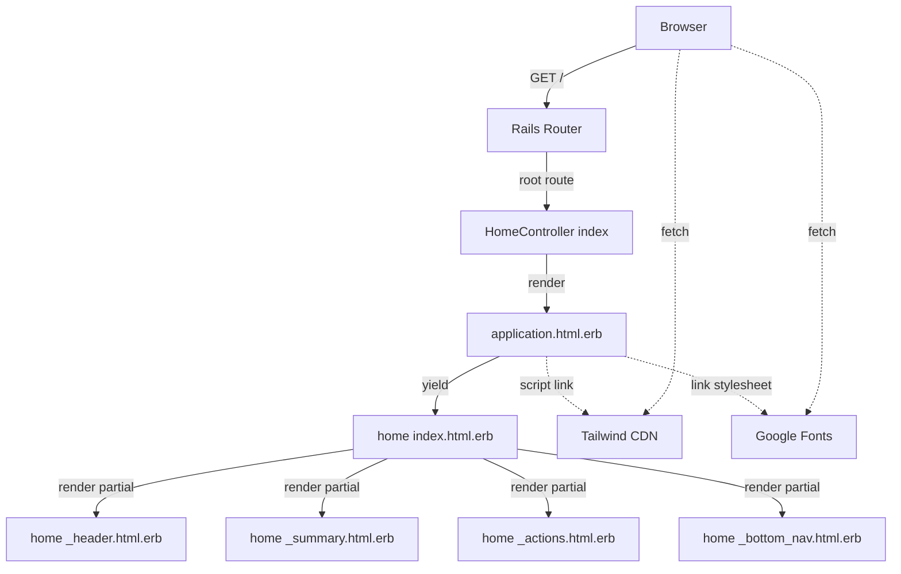

# Technical Design — home-layout

## Overview

本設計は、在庫番（Zaikoban）アプリのホーム画面（`/`）の基本レイアウトを Rails 7.1 + ERB + Tailwind CSS（CDN）で構築するための技術設計を定義する。実装基準は GitHub Issue #3（TICKET-001）の FIX HTML であり、アプリ全体のエントリ画面として、後続チケット（仮データ / 導線 / デザイントークン厳密化 / モバイル・PC 最適化 / ドメインモデル）の前提となる。

**Purpose**: 在庫番のユーザーに、デザイン仕様に準拠した視覚的に一貫したホーム画面を提供する。  
**Users**: 家庭・個人の備蓄を管理するエンドユーザー（スマホ主用）。  
**Impact**: 現在 health check のみのルーティングに `/` を追加し、`app/views` に初の画面系 view ツリーと `test/` ディレクトリを新設する。

### Goals
- `/` でホーム画面を 200 応答として静的レンダリング可能にする
- FIX HTML と視覚的に同等の HTML 出力を、partial 分割された再利用可能な構造で生成する
- Tailwind CDN + インライン `tailwind.config` + Google Fonts の読込を `application.html.erb` に集約する
- Minitest ベースの request test でルート・タイトル・主要ブロックを自動検証できる状態にする
- 後続チケット（TICKET-002 / 003 / 004 等）が壊れずに拡張できる partial 境界を確立する

### Implementation Modes（FIX HTML 取り扱い）
本チケットは実装開始時に 2 モードを許容する。

- **Mode A: FIX HTML 完全版ありモード**  
  Issue #3 に FIX HTML の `<body>` 完全版が提供された時点で採択。各 partial 内部は FIX HTML に忠実に移植する。
- **Mode B: 仮骨格モード**  
  FIX HTML 完全版が未提供のまま実装を進める場合。partial は最外殻のみ実装し、`data-testid` 付き `<section>` / `<nav>` と短いプレースホルダ文言（例: 「サマリー」「主要アクション」「ナビ」）のみ配置する。テスト 9.x 系は `data-testid` の存在と layout の読込で合格可能。FIX HTML 完全版が提供され次第、別 PR で中身を充填する。

どちらのモードでも Requirement 1–9 は満たす。Requirement 10 は運用上の前提条件で、本設計下ではどちらのモードも許容される。

### Non-Goals
- 仮データ表示（TICKET-003）
- 導線タップによる画面遷移・フォーム送信（TICKET-004）
- Tailwind デザイントークンの厳密化・partial 化・CSS 変数化（TICKET-002）
- スマホ固有最適化（TICKET-023）、PC 幅の詳細調整（TICKET-024）
- Item / Stock / Location の Active Record モデル（TICKET-021）
- `tailwindcss-rails` などのビルド統合（将来検討）
- Content Security Policy の有効化（別途検討）

## Architecture

### Existing Architecture Analysis

本リポジトリは Rails 7.1 雛形に Docker 化と一部 compose 設定のみが追加された初期状態である。ホーム画面に関して活用・考慮すべき既存の資産と制約は以下：

- `app/views/layouts/application.html.erb`: Rails 生成直後。`<title>App</title>`・viewport・CSRF/CSP・`stylesheet_link_tag "application"` のみ → 本チケットで全面的に書き換える
- `app/assets/stylesheets/application.css`: 空の sprockets manifest。Tailwind CDN と干渉せず、残置する
- `config/routes.rb`: health check `get "up"` のみ。`root` は未定義 → 追加
- `config/generators.system_tests = nil`（`config/application.rb`）: システムテスト無効 → 維持
- `test/` ディレクトリ: **未生成**。本チケットで新規に `test/test_helper.rb` と `test/controllers/` を作成する

### Architecture Pattern & Boundary Map

採択パターンは Rails 標準の **Server-Rendered MVC** + ERB partial composition。



**Architecture Integration**:
- Selected pattern: Rails 7.1 MVC + ERB partial composition。静的な初期 HTML 生成に最適で、後続の動的データ注入（TICKET-003）は partial に閉じ込めて拡張可能。
- Domain/feature boundaries: layout（全画面共通 `<head>` と骨組み） / home（ホーム画面固有の view ツリー） / test（挙動検証）を明確に分離。
- Existing patterns preserved: Rails CoC、`application.html.erb` を全画面共通 layout、sprockets manifest の残置。
- New components rationale: Home 系 view / Controller / partials と `test/` ツリーはいずれも既存不在のため新規。
- Steering compliance: `structure.md` の MVC 構造と画面軸（home / items / shopping）方針に準拠。`tech.md` の Tailwind CDN + Noto Sans JP + Material Symbols の方針に準拠。

### Technology Stack

| Layer | Choice / Version | Role in Feature | Notes |
|-------|------------------|-----------------|-------|
| Frontend (HTML/CSS) | Tailwind CSS（CDN, `cdn.tailwindcss.com` + `forms,container-queries` plugins） | ユーティリティ CSS と軽量 reset | MVP 期は CDN。TICKET-002 でビルド統合検討 |
| Frontend (Fonts / Icons) | Google Fonts（Noto Sans JP 400/500/700、Plus Jakarta Sans 400/500/600/700/800、Material Symbols Outlined） | タイポグラフィ / アイコン | 日本語本文 Noto、見出し Plus Jakarta、アイコン Material Symbols |
| Backend (App) | Ruby 3.2.8 + Rails 7.1.5.1 | MVC ルータ / コントローラ / ビュー | 既存 |
| Backend (Template) | ERB + `yield` + `render partial:` | レイアウト合成 | 標準 |
| Testing | Minitest（Rails 7.1 既定）+ `ActionDispatch::IntegrationTest` | request test | RSpec 採用せず、依存最小 |
| Data / Storage | — | （本チケットはストレージ非依存） | — |
| Infra / Runtime | Puma + Docker Compose（`web:3006→3000`） | 開発実行 | 既存構成のまま |

追加する gem は無い。Tailwind CDN と Google Fonts は外部 CDN として通信経路のみ使用する。

## System Flows

単一の同期 GET 要求のみで、ビジネスフローも状態機械もないため、System Flows 詳細は省略する（Architecture 図が十分に説明する）。

## Requirements Traceability

| Req | Summary | Components | Interfaces | Flows |
|-----|---------|------------|------------|-------|
| 1.1 | `/` を `home#index` に割当 | Routes | `Rails.application.routes` | — |
| 1.2 | `/` で 200 応答 | Routes / HomeController | `GET /` → 200 | Architecture |
| 1.3 | `home/index.html.erb` をレンダリング | HomeController / Index view | `render :index`（暗黙） | Architecture |
| 1.4 | health check 維持 | Routes | `get "up"` 保持 | — |
| 1.5 | 未定義パスの既定挙動維持 | Routes | Rails 既定 | — |
| 2.1 | 主要 4 ブロックの描画 | Index view / 4 partials | partial 合成 | Architecture |
| 2.2 | `application.html.erb` 使用 | Layout | Rails 既定 layout 解決 | — |
| 2.3 | partial 分割配置 | `_header` / `_summary` / `_actions` / `_bottom_nav` | `render` | — |
| 2.4 | 拡張容易な構造 | 4 partials | 命名規約 | — |
| 2.5 | FIX HTML の `<body>` 相当の DOM | Index view + partials | HTML 出力 | — |
| 3.1–3.3 | フォント / アイコン 3 本の読込 | Layout `<head>` | `<link rel="stylesheet">` | — |
| 3.4 | 本文に Noto Sans JP 適用 | Layout（`tailwind.config.fontFamily.sans`）+ `<body class="font-sans">` | Tailwind config | — |
| 3.5–3.6 | 見出し / アイコン適用 | partials | Tailwind class + Material Symbols | — |
| 4.1 | Tailwind CDN 読込 | Layout `<head>` | `<script>` | — |
| 4.2 | inline `tailwind.config` で primary/secondary | Layout `<head>` | `<script id="tailwind-config">` | — |
| 4.3 | `darkMode: "class"` | Layout | `tailwind.config` | — |
| 4.4 | primary/secondary クラスの使用 | partials | HTML class 属性 | — |
| 4.5 | 差し替え容易な config 配置 | Layout | 専用 `<script id>` | — |
| 5.1 | viewport meta | Layout | `<meta name="viewport">` | — |
| 5.2–5.3 | 375px / 1280px で崩れない | Index + partials | Tailwind responsive | — |
| 5.4 | 中央寄せ幅制約 | Index view の container | `max-w-md mx-auto` 相当 | — |
| 5.5 | PC 詳細最適化の委譲 | —（スコープ外） | — | — |
| 6.1–6.2 | `lang="ja"` / `class="light"` | Layout `<html>` | `<html>` 属性 | — |
| 6.3 | `charset="utf-8"` | Layout | `<meta>` | — |
| 6.4 | タイトル `在庫番 - ホーム` | Layout | `<title>` | — |
| 6.5 | CSRF/CSP ヘルパ維持 | Layout | `csrf_meta_tags` / `csp_meta_tag` | — |
| 7.1–7.2 | JS/サーバーエラー無し | 全構成要素 | Rails 標準挙動 | — |
| 7.3 | 外部リソース失敗時フォールバック | Layout + partials | 順序制御・`font-display: swap`（CDN 既定） | Error Handling |
| 8.1–8.6 | スコープ境界維持 | —（やらない） | — | — |
| 9.1 | request test で 200 | Controller Test | `get "/"` + `assert_response :success` | Testing |
| 9.2 | タイトル検証 | Controller Test | `assert_select "title"` | Testing |
| 9.3 | 主要ブロック検証 | Controller Test + partials | `assert_select '[data-testid=home-header]'` | Testing |
| 9.4 | ルーティング検証可能 | Routes Test | `assert_routing '/', controller: 'home', action: 'index'` | Testing |
| 9.5 | `test/` 配下構成 | test/ ディレクトリ | Rails 既定 | — |
| 10.1–10.3 | FIX HTML 完全版の扱い | —（プロセス要件） | Issue コメント / 仮骨格 | — |

## Components and Interfaces

### 概要

| Component | Domain/Layer | Intent | Req Coverage | Key Dependencies | Contracts |
|-----------|--------------|--------|--------------|------------------|-----------|
| Routes | Routing | `/` をホームに割当 / health check 維持 | 1.1, 1.4, 1.5 | Rails Router (P0) | State (Routing) |
| HomeController | Controller | `/` 応答・view レンダ | 1.2, 1.3, 9.1 | Rails (P0) | Service |
| application.html.erb | Layout | `<head>` 集約、Tailwind / Fonts / HTML 属性 | 3.1–3.6, 4.1–4.5, 5.1, 6.1–6.5 | HomeController (P0), CDN (P1) | State |
| home/index.html.erb | View | partial を合成してホーム本体を構成 | 2.1, 2.2, 2.4, 5.4 | application.html.erb (P0), partials (P0) | — |
| home/_header.html.erb | View (Partial) | 画面上部バー | 2.1, 2.3, 9.3 | Material Symbols (P1) | — |
| home/_summary.html.erb | View (Partial) | 在庫サマリー領域（静的プレースホルダ） | 2.1, 2.3, 9.3 | Tailwind tokens (P1) | — |
| home/_actions.html.erb | View (Partial) | 主要アクション導線（静的） | 2.1, 2.3, 9.3 | Material Symbols (P1) | — |
| home/_bottom_nav.html.erb | View (Partial) | ボトムナビ（静的） | 2.1, 2.3, 9.3 | Material Symbols (P1) | — |
| HomeControllerTest | Test | ルート / 応答 / 主要要素を検証 | 9.1–9.5 | Minitest (P0), HomeController (P0) | Service (test) |

### Routing

#### Routes

| Field | Detail |
|-------|--------|
| Intent | ルート `/` をホームに割当、health check 維持 |
| Requirements | 1.1, 1.4, 1.5, 9.4 |

**Responsibilities & Constraints**
- ルートパスを `HomeController#index` に割り当てる
- 既存の `get "up" => "rails/health#show"` を維持
- 本チケットの範囲外ルート（items / shopping 等）は追加しない

**Dependencies**
- Inbound: Rails Router（P0）
- Outbound: HomeController（P0）

**Contracts**: [x] State  
- 変更内容: `root "home#index"` を 1 行追加

```ruby
# config/routes.rb（設計上の最終形）
Rails.application.routes.draw do
  root "home#index"
  get "up" => "rails/health#show", as: :rails_health_check
end
```

**Implementation Notes**
- Integration: 既存の health check ルートとの順序は任意だが、可読性のため `root` を先頭に配置
- Validation: `assert_routing "/", controller: "home", action: "index"` で routing test 可能
- Risks: 特になし

### Controller

#### HomeController

| Field | Detail |
|-------|--------|
| Intent | `/` の GET に対し 200 で `home/index` をレンダリング |
| Requirements | 1.2, 1.3, 9.1 |

**Responsibilities & Constraints**
- `index` アクションのみ。内部ロジックや instance 変数は持たない（Req 8 に従い仮データは TICKET-003）
- 例外を発生させない（Rails 既定の view 解決に委譲）

**Dependencies**
- Inbound: Rails Router（P0）
- Outbound: Rails rendering（P0）、`application.html.erb`（P0）、`home/index.html.erb`（P0）

**Contracts**: [x] Service

##### Service Interface
```ruby
class HomeController < ApplicationController
  # GET /
  # Returns: 200 OK, Content-Type: text/html; charset=utf-8
  def index
  end
end
```
- Preconditions: Rails アプリが boot 済みで routes が解決済み
- Postconditions: レスポンスボディが `home/index.html.erb` を `application.html.erb` でラップしたもの
- Invariants: DB アクセス無し、副作用無し

**Implementation Notes**
- Integration: `ApplicationController` を継承し、現時点で `before_action` 無し
- Validation: request test が HTTP 200・主要マーカーを検証
- Risks: 空 `index` の生成時に自動で view 雛形が作られないよう、手動で生成する

### View / Layout

#### application.html.erb

| Field | Detail |
|-------|--------|
| Intent | 全画面共通の `<head>` と骨組みを提供。Tailwind / Fonts / HTML 基本属性を集約 |
| Requirements | 3.1–3.6, 4.1–4.5, 5.1, 6.1–6.5 |

**Responsibilities & Constraints**
- `<html lang="ja" class="light">` を設定
- `<head>` に charset / viewport / CSRF / CSP / タイトル / Tailwind CDN / inline `tailwind.config` / Google Fonts を配置
- `<body>` は `<%= yield %>` のみ（今チケット時点では追加 class 無しで OK、詳細は partial 側に委ねる）
- sprockets の `stylesheet_link_tag "application"` は**削除**（空の manifest のため）

**Dependencies**
- Inbound: HomeController（P0、将来の全 Controller）
- Outbound: Google Fonts（P1）、Tailwind CDN（P1）
- External: `fonts.googleapis.com`、`cdn.tailwindcss.com`

**Contracts**: [x] State

```erb
<!-- 設計上の最終形（抜粋） -->
<!DOCTYPE html>
<html class="light" lang="ja">
  <head>
    <meta charset="utf-8">
    <meta name="viewport" content="width=device-width, initial-scale=1.0">
    <title>在庫番 - ホーム</title>
    <%= csrf_meta_tags %>
    <%= csp_meta_tag %>

    <script src="https://cdn.tailwindcss.com?plugins=forms,container-queries"></script>
    <script id="tailwind-config">
      tailwind.config = {
        darkMode: "class",
        theme: {
          extend: {
            colors: {
              primary: "#335278",
              secondary: "#48654c",
            },
            fontFamily: {
              sans: ['"Noto Sans JP"', "sans-serif"],
              display: ['"Plus Jakarta Sans"', "sans-serif"],
            },
          },
        },
      };
    </script>

    <link rel="preconnect" href="https://fonts.googleapis.com">
    <link rel="preconnect" href="https://fonts.gstatic.com" crossorigin>
    <link rel="stylesheet" href="https://fonts.googleapis.com/css2?family=Noto+Sans+JP:wght@400;500;700&family=Plus+Jakarta+Sans:wght@400;500;600;700;800&display=swap">
    <link rel="stylesheet" href="https://fonts.googleapis.com/css2?family=Material+Symbols+Outlined:wght,FILL@100..700,0..1&display=swap">
  </head>
  <body class="font-sans">
    <%= yield %>
  </body>
</html>
```

**Implementation Notes**
- Integration: タイトルは MVP ではハードコード。将来 `content_for :title` に置換可能（TICKET-004 以降）
- Validation: request test で `<title>` 文字列を検証、Material Symbols / Noto Sans JP の link 存在を検証
- Risks: CSP を有効化する場合は `script-src`/`style-src`/`font-src` を調整必要。本チケットではスコープ外

#### home/index.html.erb

| Field | Detail |
|-------|--------|
| Intent | 4 つの partial を順序良く組み合わせ、モバイル中央寄せコンテナに配置 |
| Requirements | 2.1, 2.2, 2.4, 5.4 |

**Responsibilities & Constraints**
- 最外殻は `<main data-testid="home-root" class="max-w-md mx-auto">` のような中央寄せコンテナ
- partial の順序: header → summary → actions → bottom_nav
- ロジック・データ分岐を含まない（TICKET-003 で `@items` などを注入する形に拡張される前提）

**Dependencies**
- Inbound: HomeController（P0）
- Outbound: 4 つの partial（P0）

**Contracts**: なし（純粋な view テンプレート）

**Implementation Notes**
- Integration: `render "header"` の書式を採用（暗黙の `home/_header.html.erb` 解決）
- Validation: partial が不足すると `ActionView::MissingTemplate` で即時失敗するためテストで検出可能

#### home/_header.html.erb

| Field | Detail |
|-------|--------|
| Intent | 画面上部のヘッダー（タイトル文言・通知アイコン等） |
| Requirements | 2.1, 2.3, 9.3 |

**Responsibilities & Constraints**
- 最外殻に `data-testid="home-header"` を付与（テスト安定化）
- 動的値は含まない（静的テキスト）

#### home/_summary.html.erb

| Field | Detail |
|-------|--------|
| Intent | 在庫サマリー表示領域のレイアウト枠 |
| Requirements | 2.1, 2.3, 9.3 |

**Responsibilities & Constraints**
- `data-testid="home-summary"` を付与
- プレースホルダの見出し / ラベルのみ。カウント等の動的表示は TICKET-003

#### home/_actions.html.erb

| Field | Detail |
|-------|--------|
| Intent | 「使う / 補充 / 買い物」を想起させる静的アクションカード |
| Requirements | 2.1, 2.3, 9.3 |

**Responsibilities & Constraints**
- `data-testid="home-actions"` を付与
- 各カードは `<button type="button" disabled>`（挙動は TICKET-004）または `<a>` でもクリック遷移しない静的要素

#### home/_bottom_nav.html.erb

| Field | Detail |
|-------|--------|
| Intent | スマホ底部の固定ナビ（静的アイコン＋ラベル） |
| Requirements | 2.1, 2.3, 9.3 |

**Responsibilities & Constraints**
- `data-testid="home-bottom-nav"` を付与
- `aria-label="メインナビゲーション"` を `<nav>` 要素に付与

### Test

#### HomeControllerTest

| Field | Detail |
|-------|--------|
| Intent | `/` の応答・layout・主要 partial ブロックの存在・ルーティングを自動検証 |
| Requirements | 9.1, 9.2, 9.3, 9.4, 9.5 |

**Responsibilities & Constraints**
- `ActionDispatch::IntegrationTest` を継承
- DB 不要（fixture 無し）
- 実装と独立に Red → Green を通せること（TDD 前提）

**Dependencies**
- Inbound: `rails test`（P0）
- Outbound: HomeController / views（P0）

**Contracts**: [x] Service（test）

##### Test Cases
| # | Name | Assertion |
|---|------|-----------|
| T1 | `test "GET / responds with 200"` | `get "/"` → `assert_response :success` |
| T2 | `test "GET / renders home title"` | `assert_select "title", "在庫番 - ホーム"` |
| T3 | `test "GET / contains home header block"` | `assert_select "[data-testid=?]", "home-header"` |
| T4 | `test "GET / contains summary, actions, bottom nav blocks"` | 同様に `home-summary`, `home-actions`, `home-bottom-nav` |
| T5 | `test "GET / loads tailwind CDN"` | `assert_select "script[src*='cdn.tailwindcss.com']"` |
| T6 | `test "GET / loads Noto Sans JP and Material Symbols"` | `assert_select "link[href*='Noto+Sans+JP']"`, `link[href*='Material+Symbols']` |
| T7 | `test "root route is home#index"` | `assert_routing "/", { controller: "home", action: "index" }` |
| T8 | `test "body uses font-sans class (Noto Sans JP via tailwind config)"` | `assert_select "body.font-sans"` |

**Implementation Notes**
- Integration: `test/test_helper.rb` は Rails 7.1 既定内容で生成（`require "rails/test_help"` など）
- Validation: CI 導入までは `docker-compose exec web bin/rails test` を開発者が手動実行
- Risks: `assert_select` の DOM マッチャは ERB 更新に追従するため壊れにくいが、クラス名ベースにしないことが重要（`data-testid` 前提）

## Data Models

本チケットでは永続データを扱わないため省略する。将来の TICKET-021（Item / Stock / Location）で導入される。

## Error Handling

### Error Strategy

| カテゴリ | シナリオ | 対応 |
|---|---|---|
| User Error (4xx) | 未定義 URL | Rails 既定の 404（`public/404.html`）を維持、変更しない |
| System Error (5xx) | コントローラ / view 解決失敗 | Rails 既定 `500`（`public/500.html`）、本チケットでは内部で例外を出さない設計 |
| External Resource (CDN) | Tailwind CDN / Google Fonts 取得失敗 | `font-display: swap`（Google Fonts 既定）+ Tailwind 未ロード時もプレーン HTML として可読に（`<body>` が意味のある DOM を保持） |

### Monitoring

- Rails 標準の `log/development.log`・`log/production.log` を利用
- 本チケットでは追加のロガー・APM は導入しない

## Testing Strategy

本チケットは UI 中心かつ静的のため、単体・統合の境界は曖昧。Minitest の `ActionDispatch::IntegrationTest` を主軸とし、TDD で駆動する。

### Unit Tests（Routes / Controller）
- Routes: `root "home#index"` の割当が `assert_routing` で解決
- HomeController: `index` アクションが引数なしで呼べて例外を発しない（request test で兼ねる）

### Integration Tests（request spec 相当）
- T1–T6（上表）: 応答 / layout / partial / CDN 読込

### E2E / System Tests
- システムテストは `config.generators.system_tests = nil` の方針に従い本チケットでは扱わない

### Performance / Load
- 静的 HTML の応答のみのため対象外。CDN 経由の外部依存は対象外とし、性能要件は将来のチケットに委ねる

### Manual Verification（DoD）
自動テスト化しない受入確認項目を DoD に組み込む（実装者が `docker-compose up` 後に目視）。

- M1: iPhone 375px / PC 1280px の 2 幅でレイアウトが崩れないこと（Req 5.2, 5.3）
- M2: DevTools > Network で `cdn.tailwindcss.com` をブロックしても `/` が 200 で返り、本文テキストが読めること（Req 7.3）
- M3: DevTools > Network で Google Fonts を両方ブロックしても `/` が 200 で返り、本文がシステムフォントで読めること（Req 7.3）
- M4: ブラウザコンソールに JS エラーが出ないこと（Req 7.1）

### TDD サイクル（実装順）
1. **Red**: Routes Test 追加 → fail（routes 未設定）
2. **Green**: `root "home#index"` 追加 → fail（HomeController 不在）
3. **Red → Green**: 最小 `HomeController` + 空 `index.html.erb` → T1 通過
4. **Red**: T2（title）追加 → fail
5. **Green**: layout を書き換え → T2 通過
6. **Red → Green**: T3–T6 を順に追加して partial を実装 → 全緑
7. **Refactor**: 命名・partial 分割・重複排除、視覚確認（`docker-compose up`）

## Security Considerations

- CSRF: `csrf_meta_tags` を layout に保持
- CSP: 本チケットでは initializer を有効化しないが、将来有効化時に CDN（`cdn.tailwindcss.com`, `fonts.googleapis.com`, `fonts.gstatic.com`）の許可が必要になる点を記録
- XSS: 仮データ無しのため入力由来の描画なし。ERB の既定エスケープで将来も安全に保つ
- Clickjacking: Rails 既定の X-Frame-Options SAMEORIGIN を維持

## Performance & Scalability

- ホーム画面は本チケット範囲で完全静的。性能目標は定義しないが、CDN 遅延によるレンダリング遅延を最小化するため、`<link rel="preconnect">` を Google Fonts 2 ドメインに対して追加する
- Tailwind CDN は JS ベースの再計算を伴うため本番化時は `tailwindcss-rails` を推奨（TICKET-002 で評価）

## Migration Strategy

既存ホーム画面は無いため、マイグレーションは不要。互換性検討は `application.html.erb` 書き換えの影響範囲のみ：

- 影響: 将来 `app/views/` に別コントローラの view が追加されても同 layout を共有するため、Tailwind / Fonts の読込コストが全画面に波及することを明記（TICKET-002 での最適化対象）

## Supporting References

- Gap 分析と代替案比較の詳細: `.kiro/specs/home-layout/research.md`
- Steering: `.kiro/steering/{product,tech,structure}.md`
- FIX HTML: GitHub Issue #3 本文
- Rails Guides: Routing / Layouts & Rendering / Testing
- Tailwind Play CDN: https://tailwindcss.com/docs/installation/play-cdn
- Google Fonts: https://fonts.google.com/icons
